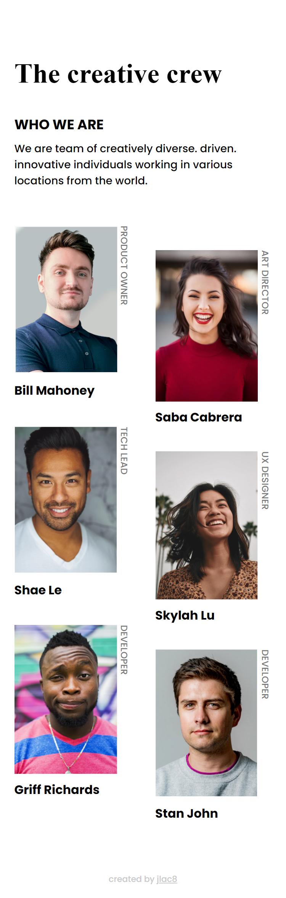
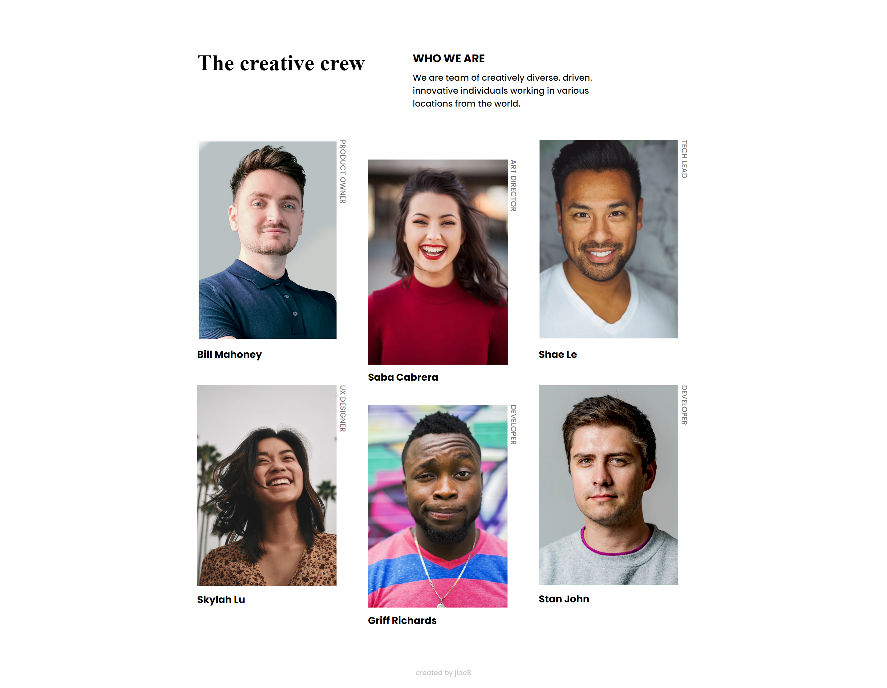

# Make It Real - MY TEAM PAGE

This is a solution to the My Team Page project of the Make It Real top full stack developer program.

## Table of contents

- [Overview](#overview)
  - [The challenge](#the-challenge)
  - [Screenshot](#screenshot)
- [My process](#my-process)
  - [Built with](#built-with)
  - [What I learned](#what-i-learned)
  - [Continued development](#continued-development)
  - [Useful resources](#useful-resources)
- [Author](#author)
- [Acknowledgments](#acknowledgments)

## Overview

### The challenge

Su desafío es construir una pagina responsive para mostrar a tu team y lograr que se parezca lo más posible al diseño.

Puedes usar cualquier herramienta que te guste para ayudarte a completar el desafío. Entonces, si tienes algo que te gustaría practicar, no dudes en intentarlo.

Sus usuarios deberían poder:

- Ver el diseño óptimo según el tamaño de pantalla de su dispositivo

### Screenshot




## My process

1. Create semantic HTML for mobile app
2. Add classes and id
3. Import the font [Poppins](https://fonts.google.com/specimen/Poppins)
4. Style the heading
5. Style the paragraph
6. Style the images
7. Style the footer
8. Adjust for Mobile: 375px
9. Add @media

### Built with

- Semantic HTML5 markup
- CSS custom properties
- Flexbox
- Mobile-first workflow

### What I learned

I learn the use of divs for css styles, like grid. I learn the difference between serif and sans-serif, how to use nth-child to aply styles with logic, and how to use flex properties.

```css
@media (min-width: 525px) {
  .images {
    grid-template-columns: repeat(
      3,
      1fr
    ); /* Tres columnas para los miembros del equipo */
    gap: 2rem; /* Espacio mayor entre columnas */
    max-width: 1200px;
    justify-items: space-between;
  }

  .images > :nth-child(2n) {
    transform: translateY(0rem); /* Baja toda la columna derecha */
  }

  .images > :nth-child(3n + 2) {
    transform: translateY(
      2rem
    ); /* Baja solo los elementos de la columna del medio */
  }

  .text-content {
    display: grid;
    grid-template-columns: 1fr 1fr;
    justify-content: space-between;
  }
}
```

### Continued development

I'll continue to learn css properties.

### Useful resources

- [Example resource 1](https://www.example.com) - This helped me for XYZ reason. I really liked this pattern and will use it going forward.
- [Example resource 2](https://www.example.com) - This is an amazing article which helped me finally understand XYZ. I'd recommend it to anyone still learning this concept.

## Author

- Website - [Add your name here](https://www.your-site.com)
- Twitter - [@yourusername](https://www.twitter.com/yourusername)

## Acknowledgments

This is where you can give a hat tip to anyone who helped you out on this project. Perhaps you worked in a team or got some inspiration from someone else's solution. This is the perfect place to give them some credit.
